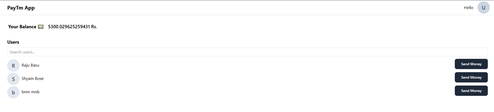
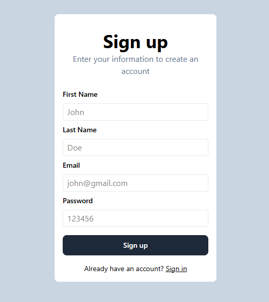
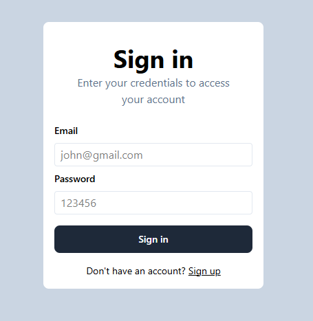
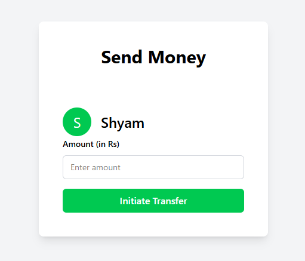

# 💳 PayTM Clone

A full-stack web application that replicates core functionalities of the PayTM platform, including user authentication, wallet management, and peer-to-peer money transfers.

---

## 🚀 Features

- **User Authentication** – Secure sign-up and login.
- **Wallet Management** – View and manage your balance.
- **Peer-to-Peer Transfers** – Send money to other users.
- **User Directory** – Search and view user profiles to send Money.

---

## 🛠️ Tech Stack

- **Frontend**: React.js, Tailwind CSS
- **Backend**: Node.js, Express.js
- **Database**: MongoDB
---

## 🧑‍💻 Getting Started

### Prerequisites

- Node.js and npm
- MongoDB (local or Atlas)

### Installation

1. **Clone the Repository**

```bash
git clone https://github.com/Kingsuk-03/PayTM-Clone.git
cd PayTM-Clone
```
2. **Setup Backend**

```bash
cd backend
npm install
```
3. **Setup Frontend**

```bash
cd ../frontend
npm install
```
## Demo Screenshots
<!-- Top Preview Image -->
<p align="center">
  
</p>

<!-- Side-by-side Preview Images -->
<p align="center">
  
  
  
</p>

